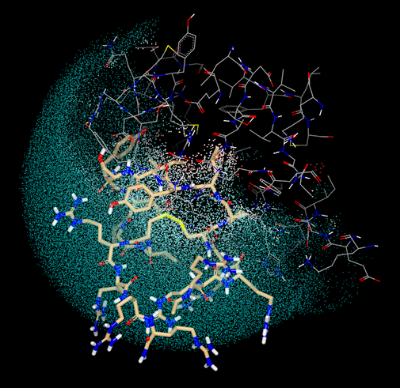

# SzmapGridUseCase
Explore the use case of Szmap grids

The following image shows grid in Cloud representation, where the hydrophobic region (PPI favorable) is weighted in spherically spread unmasked region.



## Purposes

In some occasion, ligands are not such small drug-like compounds. This is to explore some use cases of Szmap grids to apply to an extended study around active sites.

1) Use any of Szmap grids to create an effective ROCS query
2) Use any of Szmap grids to create a negative image for FRED docking 

### Data

The following structure files (except PDB) are kindly provided by a customer.

| filename | Hydrogens | Partial charges | Water |
|:---|:---:|:---:|:---:|
| data/5xco_schrodinger2017-4.mol2           | Y | N | N |
| data/5xco_schrodinger2017-4_minimized.mol2 | Y | Y | N |
| data/5xco_moe20160802.mol2                 | Y | Y | Y |
| data/5xco_moe20160802_minimized.mol2       | Y | Y | Y |
| data/5xco.pdb                              | N | N | Y |

### Preparation for Szmap
1) Water is available (forcibly eliminated)
2) Partial charges are given (if not available)
3) Hydrogens are placed (if not available)

See Makefile for prep in each individual case.

pch (in Szmap suites) and pch5.py (by OEChem and Quacpac TK) are tested.

### Szmap execution
```
szmap -mpi_np 8 -results_set max -prefix work/PREFIX -protein PROTEINFILE.oeb -around_mol LIGANDFILE.oeb
```

All the results can be seen in VIDA state file (which can be merged from 20MB chunks).

```
cat _work/5xco_szmap_grids.oes.* > 5xco_szmap_grids.oes
vida 5xco_szmap_grids.oes
```

### Experiments

I really mean it, experiments!!

```
python experiments/merge.py work/5xco_pch5.oeb.gz
```

#### About code
**numpy** is used for convenience in handling grid values in array.<br/>
AlgebraicGrid which inherits OEScalarGrid has arithmetic functions operate on grids. This is highly useful for doing experiments.

### Observations

#### About pch5.py
Schroedinger, MOE complexes, and OpenEye molecules (pch or pch5.py) give similar neut_diff_apo_free_energy_grid (with slight difference in structures). pch5.py seems to be fairly reliable on this observation.

### RESULTS!

